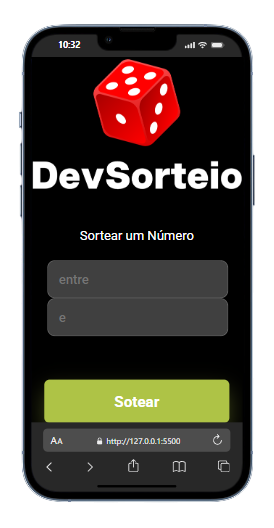

🎲 Projeto Sorteio de Números — JS
Este é um projeto simples e interativo feito com HTML, CSS e JavaScript, que permite ao usuário realizar sorteios de números aleatórios com apenas um clique. Ideal para brincadeiras, decisões rápidas ou estudos de lógica em JS!


---
# 🖼 Demonstração do Projeto

<p>

</p>

---

✨ Funcionalidades

- Geração de números aleatórios com um clique

- Interface simples e responsiva

- Código limpo e fácil de entender

---

🛠️ Tecnologias usadas
HTML — estrutura da página

CSS — estilização visual

JavaScript — lógica de sorteio e interatividade

---
## 📂 Estrutura de arquivos
```
Projeto--Sorteio--JS/
├── index.html       📄 Página principal
├── styler.css       🎨 Estilos visuais
├── math.js          🧠 Lógica de sorteio
└── assets/          🖼️ Imagens e ícones
```
---
🚀 Como usar
Você pode executar o projeto localmente sem instalar nada! Basta seguir os passos abaixo:

🔧 Requisitos
Um navegador moderno (Chrome, Firefox, Edge, etc.)

(Opcional) Editor de código como VS Code para explorar os arquivos

📦 Passo a passo
Clone ou baixe o repositório:

```bash
git clone https://github.com/Klausdmkb/Projeto--Sorteio--JS.git
Ou clique em Code > Download ZIP e extraia os arquivos.
```
- Abra o projeto:

- Vá até a pasta onde os arquivos foram salvos

- Dê dois cliques no arquivo index.html

- O navegador abrirá o site de sorteio automaticamente
Use o sistema:

- Clique no botão de sorteio

- Veja o número aleatório gerado na tela

- Repita quantas vezes quiser!

---

## 📄 Licença

-Este projeto foi desenvolvido com fins educacionais como parte dos estudos realizados na plataforma **DevClub**, sob orientação do professor **Rodolfo Mori**.

-Você pode utilizar, modificar e compartilhar este código livremente para fins de aprendizado e prática pessoal.  
-Caso deseje utilizar em projetos públicos ou comerciais, recomenda-se manter os créditos originais.

*Todos os direitos de ensino e metodologia pertencem ao DevClub e Rodolfo Mori.*

🚀 Aprenda mais em: [https://devclub.com.br](https://devclub.com.br)
